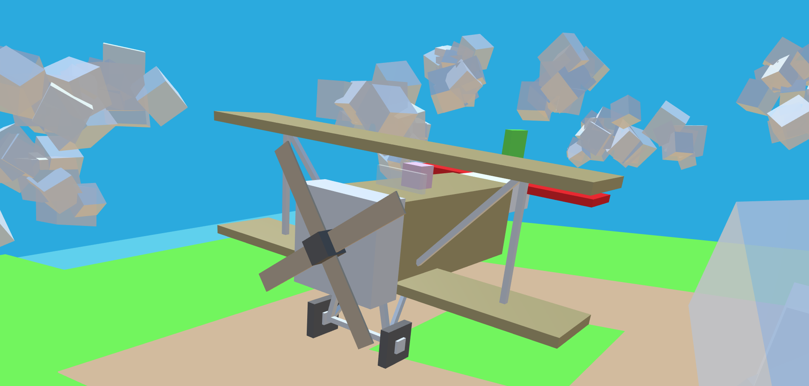
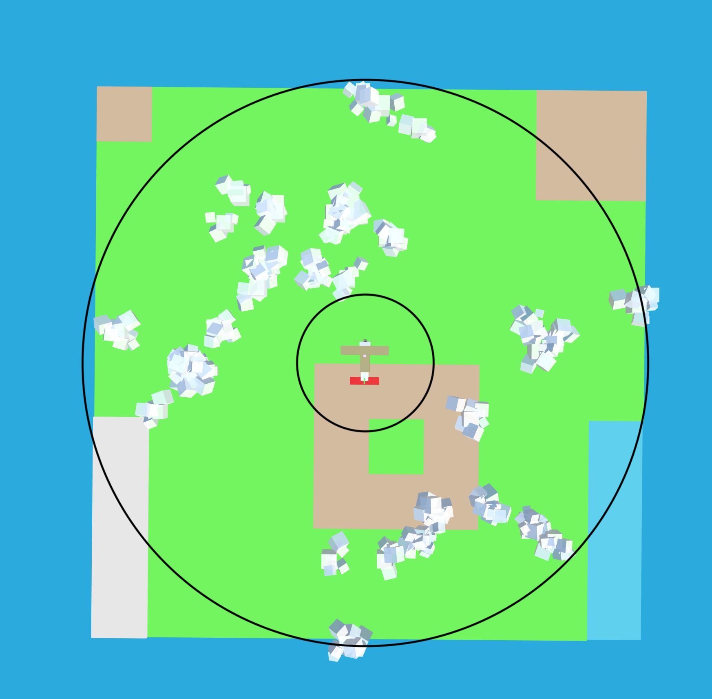
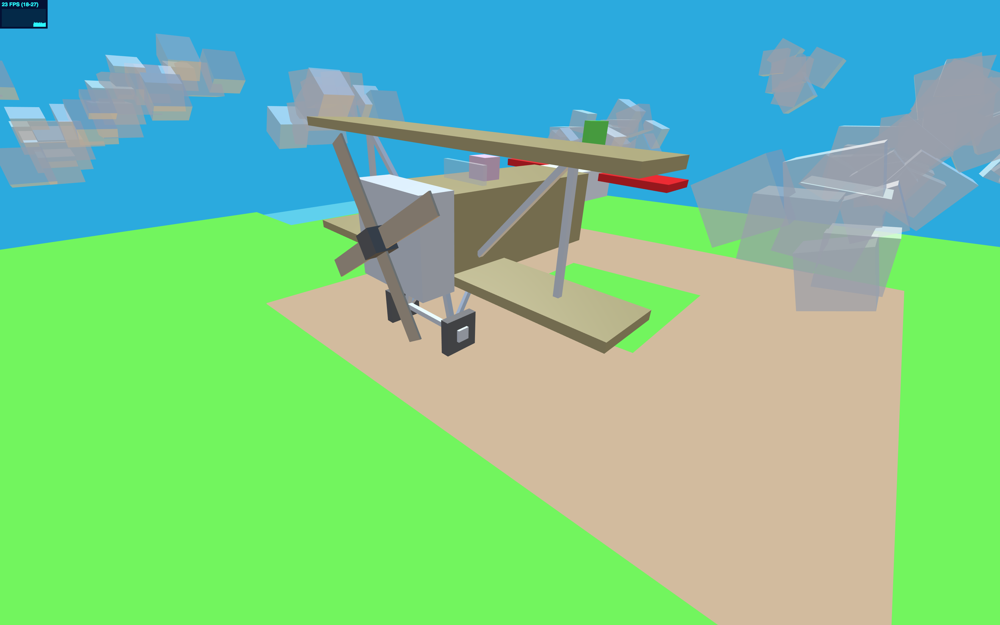
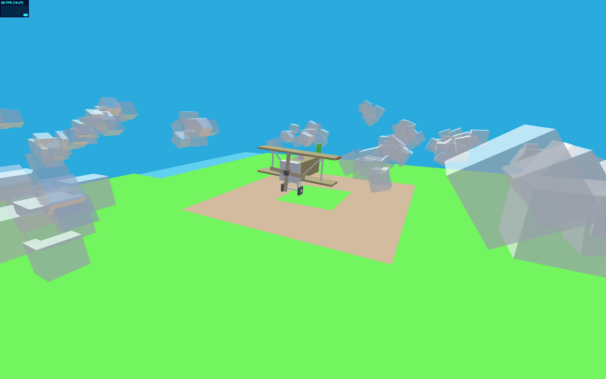
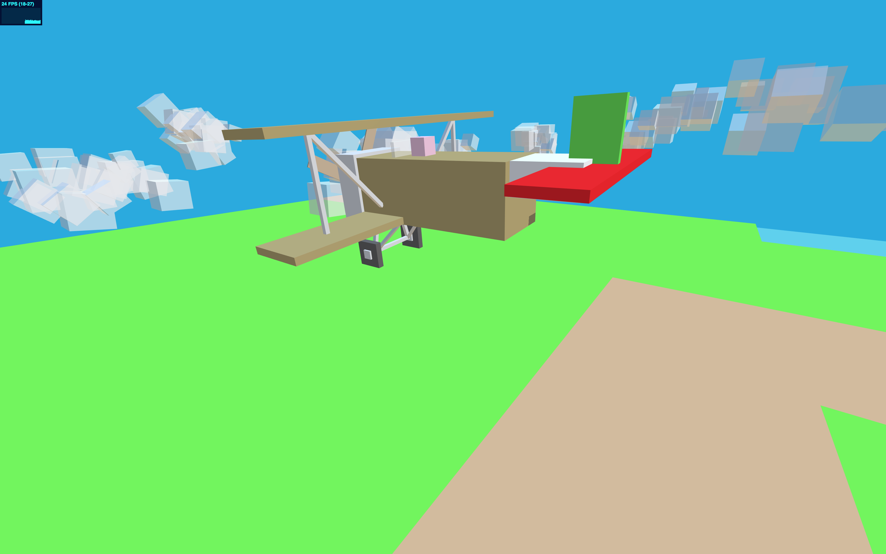
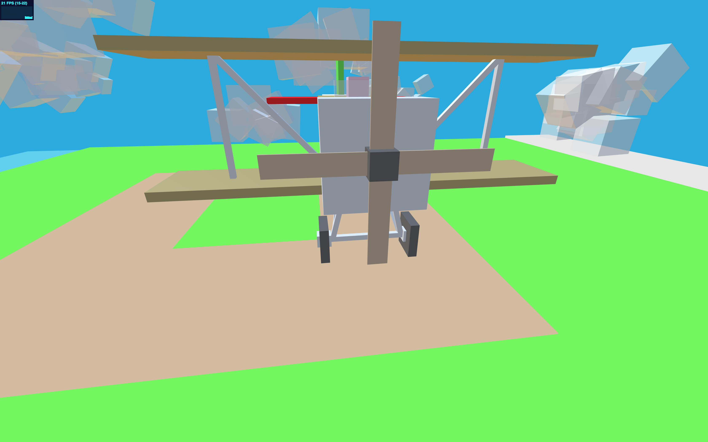
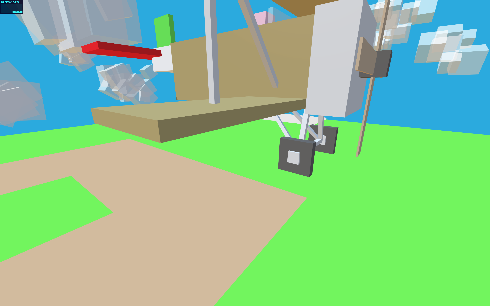
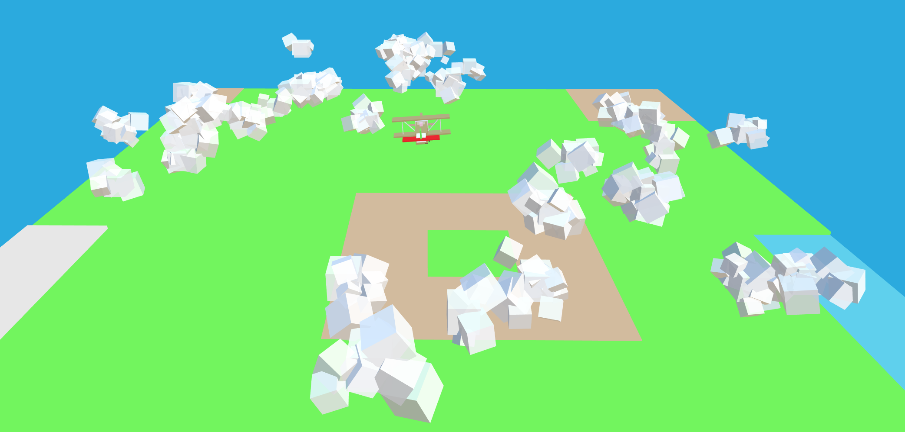
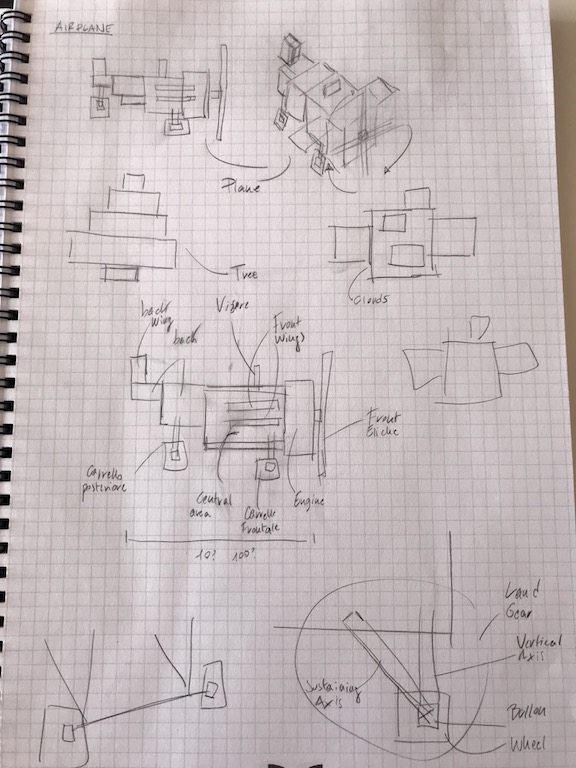

  
  <h1>Project Ancillotto</h1>

# Project Report
The goal of this project is to create a simple sene in THREEJS using voxel graphic style.
Specifically, the sene represent an airplane, the *Nieuport 11* used by *Giannino Ancillotto*, that is flying through a group of clouds.
The airplane has its propeller animated, with a rotation around the `x` axis, and also the overall roll and yaw of the airplane are slightly changed randomly to give the illusion of an actual flying airplane.

Clouds are generated randomly in group (as an `Object3D`), which is composed by a random number of clouds. Each cloud has a random size and position: 
- By size I mean that there is always a central box around which are created other boxes, in random number, that are positioned near the central box to compose a single cloud. These new small boxes are scaled and rotated among all the three axes.
- The position of the cloud is dediced randomly inside an area that we can imagine a cylinder with an hole in the middle. The clouds get generated randomly inside the area of this cylinder, at a random angle, and height. The area removed from the imaginary cylinder was needed to overcome the possibility to instantiate a cloud overlapping the airplane in the centre of the scene.

*In the screenshot above we can't see the shift of the clouds in the Y axis but it's present. Anyway, it is possible to notice the different composition of each cloud both in term of size and position.*

## Files
- __Starting Point__: `StartingCode-withLights.html` - *NOW* -> `index.html`
- __Main project JS__: `project/main.js`

# Results
In the end I met the goal defined in the `GUIDELINES.md`. There are at least 30 boxes and I've decided to create the heightmap terrain.
*The terrian can be seen from above in the screenshot of the cloud group.*

## Screenshots

# Process
I started thinking about a simple scene to implement. Searched for some voxel graphic images online. Come up with the idea of an airplane and basically iterated over it. 
I sketched the plane on paper and simply coded it on the vscode editor. Then simply while coding I was changing and trying things and modelled it the way it is now. In the journal there is a quite good description of the steps that I followed and what I was thinking to do from start-to-finish.

## Sketches
